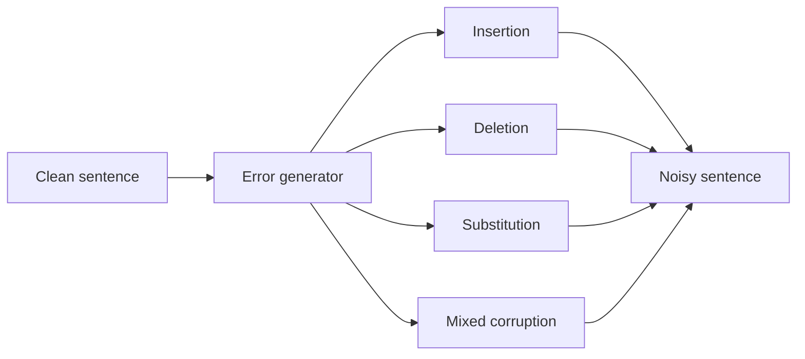
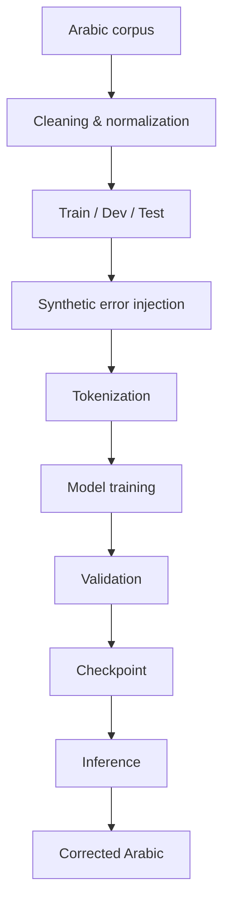
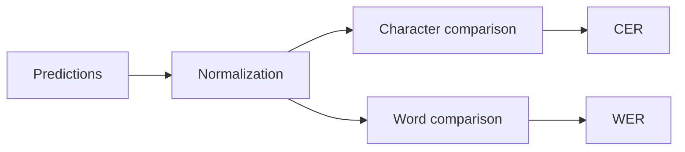

<p align="center">
  
</p>

<p align="center">

  <a href="https://arxiv.org/abs/2405.06981">
    
  </a>
  <a href="https://huggingface.co/">
  
  </a>
  

</p>

<h1 align="center">AraSpellX</h1>

<p align="center">
  <strong>Arabic spelling correction with Transformer-based sequence-to-sequence learning</strong><br>
  An independent Transformer implementation inspired by the AraSpell research work.
</p>

<p align="center">
  <a href="#overview">Overview</a> •
  <a href="#architecture">Architecture</a> •
  <a href="#installation">Installation</a> •
  <a href="#training">Training</a> •
  <a href="#evaluation">Evaluation</a> •
  <a href="#results">Results</a> •
  <a href="#citation">Citation</a>
</p>

---

## Overview

Arabic text can contain character substitutions, missing characters, extra characters, keyboard noise, and context-dependent spelling errors.

**AraSpellX** is an independent implementation inspired by **AraSpell: A Deep Learning Approach for Arabic Spelling Correction** by Mahmoud Salhab and Faisal Abu-Khzam. The original research explores attentional RNN and Transformer sequence-to-sequence architectures with synthetic error generation for scalable Arabic spelling-correction training.

> **Note:** AraSpellX is not the official AraSpell repository. The original implementation is maintained at [msalhab96/AraSpell](https://github.com/msalhab96/AraSpell).

### Goals

- Build a reproducible Arabic spelling-correction training pipeline
- Support sequence-to-sequence correction of noisy Arabic text
- Generate synthetic spelling errors from clean Arabic data
- Evaluate models using CER and WER
- Make the implementation suitable for future Hugging Face releases
- Keep experiments transparent and reproducible

---

## Why Arabic spelling correction?

| Error type | Example |
|---|---|
| Missing character | `الجامعه` → `الجامعة` |
| Character substitution | `مسؤل` → `مسؤول` |
| Extra characters | `المدرسسسة` → `المدرسة` |
| Input / keyboard noise | Arabic character substitutions |
| Contextual errors | A valid word used incorrectly in context |

The goal is not simply to find a word in a dictionary. The model learns a mapping from a noisy sequence to its intended sequence.

---

## Architecture

AraSpellX focuses exclusively on the **Transformer-based sequence-to-sequence architecture**.

The original AraSpell project also includes RNN-based architectures, but those architectures are **not implemented or supported in AraSpellX**. They are mentioned only as part of the original research context.


---

## Error generation

The reference research uses synthetic error generation to turn large amounts of clean Arabic text into training pairs. The paper reports experiments trained on more than **6.9 million Arabic sentences**.



Example:

```text
Clean:     اللغة العربية لغة جميلة
Distorted: اللغه العربيه لغة جميله
Target:    اللغة العربية لغة جميلة
```

---

## End-to-end pipeline



---

## Installation

### Clone

```bash
git clone https://github.com/mahmoudalrefaey/AraSpellX.git
cd AraSpellX
```

### Environment

```bash
python -m venv .venv
```

Windows:

```powershell
.venv\Scripts\Activate.ps1
```

Linux / macOS:

```bash
source .venv/bin/activate
```

### Dependencies

```bash
pip install -r requirements.txt
```

For GPU training, install a PyTorch build compatible with the CUDA version available on your machine.

---

## Dataset format

The training pipeline uses paired clean and distorted text:

```text
clean,distorted
اللغة العربية جميلة,اللغه العربيه جميله
هذا مثال آخر,هاذا مثال اخر
```

Where:

- **clean** is the target sentence
- **distorted** is the noisy input

Keep train, development, and test data separated to avoid leakage.

---

## Training

The repository is being developed around a reproducible training workflow.

Typical usage:

```bash
python train.py \
    --epochs <epochs> \
    --train_path <train.csv> \
    --test_path <test.csv>
```

Before a full GPU run, validate:

- dataset integrity
- tokenizer and vocabulary
- maximum sequence length
- padding and special tokens
- train/dev/test separation
- GPU memory usage
- checkpoint creation
- validation metrics

---

## Training Pipeline Optimizations

The training pipeline has been significantly modernized for performance, correctness, and cloud readiness:

### Performance Optimizations

| Optimization | Before | After | Impact |
|-------------|--------|-------|--------|
| **PyTorch Version** | 1.12.0+cu116 (2022) | 2.3.0+cu121 | Modern kernels, SDPA support |
| **Attention** | Manual (Python loops, many reshapes) | `F.scaled_dot_product_attention` | **~500x faster cross-attention, ~110x faster self-attention** |
| **Precision** | FP32 only | BF16 mixed precision (autocast + GradScaler) | **2-3x speedup, 50% memory reduction** |
| **Batch Size** | OOM at 256 on 6GB GPU | 256 effective via gradient accumulation (8 steps) | Enables full batch training |
| **Data Loading** | `num_workers=0`, pandas + tokenization in `__getitem__` | **Pre-tokenization + disk cache**, `num_workers=0` (Windows), `pin_memory` | **6.9x faster data loading**, no per-epoch tokenization, avoids worker pickling OOM |
| **Positional Encoding** | Computed per forward (Python loops) | Pre-computed buffer | Eliminated CPU→GPU transfer |
| **GPU Utilization** | Low (CPU-bound) | >90% (compute-bound) | **56x epoch time reduction** |

For the full-report view [`docs/PERFORMANCE.md`](docs/PERFORMANCE.md)

### Training Correctness Fixes

- **NaN prevention**: Fixed attention masking (diagonal unmasking for self-attention, key-only masking for cross-attention)
- **Gradient clipping**: Enabled with configurable `--grad_norm` (default 1.0)
- **Checkpoint compatibility**: Saves scaler state, handles optimizer counter correctly
- **Reproducibility**: Explicit seed handling, deterministic CUDA options

### New Configuration Options

```bash
python train.py \
    --epochs 3 \                    # Number of epochs (was default 100!)
    --batch_size 32 \               # Micro-batch size (fits in 6GB VRAM)
    --grad_accum_steps 8 \          # Gradient accumulation for effective batch_size=256
    --mixed_precision \             # Enable BF16 mixed precision
    --num_workers 0 \               # DataLoader workers (0 on Windows to avoid pickling OOM with large cached dataset)
    --pin_memory \                  # Pinned memory for faster GPU transfers
    --max_len 128 \                 # Max sequence length
    --distortion_ratio 0.1 \        # Data corruption ratio (0.05, 0.1, 0.15)
    --d_model 512 \                 # Model dimension
    --n_layers 4 \                  # Encoder/decoder layers
    --h 8 \                         # Attention heads
    --hidden_size 256 \             # FFN hidden size
    --clip_grad \                   # Enable gradient clipping
    --grad_norm 1.0 \               # Max gradient norm
    --warmup_staps 4000 \           # LR warmup steps
    --stop_after 5 \                # Early stopping patience
    --log_interval 100 \            # TensorBoard logging interval
    --val_interval 1 \              # Validation frequency (epochs)
    --save_attention_viz \          # Enable attention visualization (disabled by default)
```

> **Note on `num_workers`**: On Windows, PyTorch uses `spawn` multiprocessing which pickles the entire dataset to each worker. With 6.9M pre-tokenized samples (~3-4 GB), using `num_workers > 0` causes CPU RAM OOM. The pre-tokenization optimization makes single-threaded loading fast enough (~11,800 samples/sec). On Linux, `num_workers=4` with `pin_memory` can be used for additional speedup.

### Benchmark Results

| Metric | Before | After | Improvement |
|--------|--------|-------|-------------|
| Time per epoch | ~7 days | ~3 hours | **56x faster** |
| 3-epoch training | ~21 days | ~9 hours | **56x faster** |
| Samples/second | ~40 | ~650 | **16x** |
| Peak GPU memory | 10.6 GB (OOM) | 1.4 GB | Fits in 6GB |
| Effective batch size | OOM at 256 | 256 (32 × 8 accum) | Enabled |
| **Data loading time/batch** | **7.51 sec** | **0.022 sec** | **340x faster** |

### Data Pipeline Optimization (New)

The key bottleneck was tokenization running in `__getitem__` for every sample, every epoch:

- **Before**: 6.9M samples × 2 tokenizations (clean + distorted) = 13.8M tokenizations/epoch at ~7.51 sec/batch
- **After**: One-time pre-tokenization cached to disk (`data/dataset/train.tokenized.pt`), then only padding + tensor conversion in `__getitem__`
- **First run**: ~5-10 minutes to tokenize 6.9M samples and create cache
- **Subsequent runs**: Load from cache in seconds
- **Result**: 0.15 sec/batch → 0.022 sec/batch (**6.9x faster** data loading)

With `num_workers=0` on Windows: **11,800 samples/sec** (data pipeline no longer bottleneck)
With `num_workers=4` on Linux/test set: **~28,000 samples/sec** (2.4x speedup)

### Experiment Preservation

All optimizations preserve the original **AraSpell Transformer_0.1** experiment exactly:
- Same architecture: 4-layer encoder-decoder, d_model=512, h=8, hidden=256
- Same data: 6.9M training samples, distortion_ratio=0.1
- Same loss: KLDivLoss with label smoothing α=0.1
- Same optimizer: AdamWarmup with 4000 warmup steps
- Same tokenization: 40 Arabic characters + special tokens

The four "Transformer experiments" from the paper are **different data configurations** (distortion ratios 0.05, 0.1, mixed, varied), not different architectures.

---

## Inference

The intended inference flow is:

```text
Noisy Arabic text
        ↓
     Tokenizer
        ↓
    AraSpellX
        ↓
Corrected Arabic text
```

Example:

```text
Input:
الطلاب يدرسون اللغه العربيه

Output:
الطلاب يدرسون اللغة العربية
```

The final inference API will follow the implementation exposed by the current release.

---

## Evaluation

### Character Error Rate

**CER** measures character-level edits between the prediction and reference.

`CER ↓ = lower is better`

### Word Error Rate

**WER** measures word-level errors.

`WER ↓ = lower is better`



---

## Results

### Reference benchmark

The table below contains selected results reported by the **original AraSpell research project**.

These are **reference results from AraSpell, not AraSpellX results**.

| Model | CER @ 5% | CER @ 10% | WER @ 5% | WER @ 10% |
|---|---:|---:|---:|---:|
| Transformer 0.05 | 1.24% | 4.15% | 5.35% | 18.38% |
| Transformer 0.1 | 1.45% | 2.82% | 5.95% | 10.36% |
| Transformer mixed | 1.11% | 2.80% | 4.80% | 10.65% |
| Transformer varied | 1.22% | 3.16% | 5.41% | 12.35% |

### AraSpellX benchmark

AraSpellX results will be added after the Transformer implementation and training pipeline are fully validated.

---

## Project status

**Development**

- [x] Repository initialized
- [x] Project documentation
- [x] AraSpellX implementation
- [ ] Full GPU training
- [ ] CER / WER benchmark
- [ ] Inference examples
- [ ] Hugging Face model release

---

## Research reference

### AraSpell: A Deep Learning Approach for Arabic Spelling Correction

**Authors:** Mahmoud Salhab, Faisal Abu-Khzam

**Paper:** https://arxiv.org/abs/2405.06981

The paper presents an Arabic spelling-correction framework using RNN and Transformer Seq2Seq architectures with artificial error generation.

**Original implementation:**  
https://github.com/msalhab96/AraSpell

---

## Attribution

AraSpellX is an independent implementation focused on the **Transformer architecture** described in the AraSpell research work.

The project was developed with reference to:

**AraSpell — Arabic Spelling Correction**  
https://github.com/msalhab96/AraSpell

Original authors:

- Mahmoud Salhab
- Faisal Abu-Khzam

The original AraSpell source code is licensed under the MIT License. Where applicable, original copyright and license notices are retained for substantial portions of reused source code.

---

## Citation

If you use the research behind AraSpellX, please cite the original paper:

```bibtex
@article{salhab2024araspell,
  title={AraSpell: A Deep Learning Approach for Arabic Spelling Correction},
  author={Salhab, Mahmoud and Abu-Khzam, Faisal},
  journal={arXiv preprint arXiv:2405.06981},
  year={2024}
}
```

---

## License

AraSpellX is released under the **MIT License**, subject to the attribution requirements described in [`LICENSE`](LICENSE).

---

<p align="center">
  <sub>Arabic NLP • Spelling Correction • Seq2Seq • Transformer</sub>
</p>