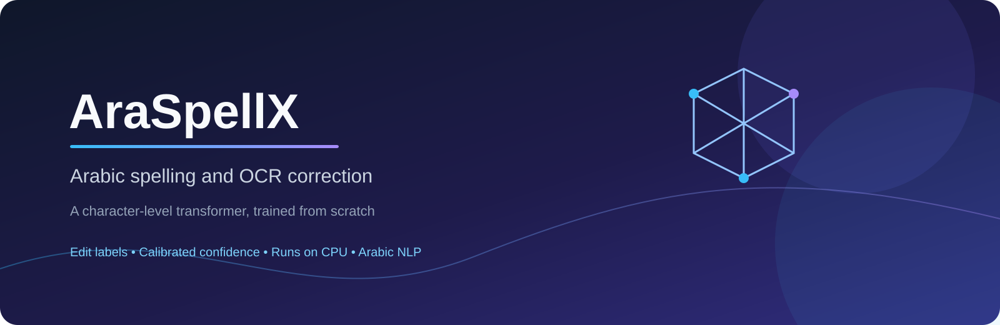
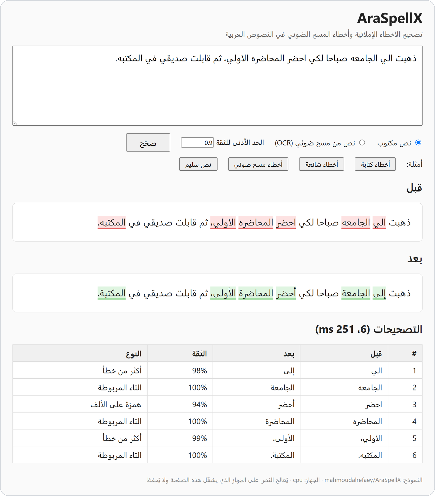
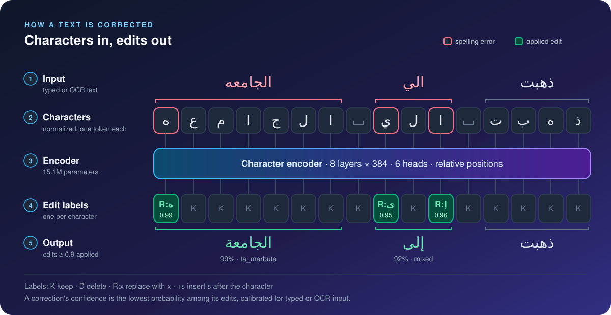
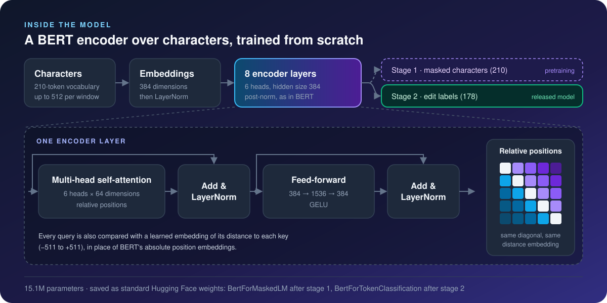

<p align="center">
  
</p>

<p align="center">
  <a href="https://araspellx.streamlit.app"></a>
  <a href="https://huggingface.co/mahmoudalrefaey/AraSpellX"></a>
</p>

<p align="center">
  
  
  
  
  <a href="LICENSE"></a>
</p>

<p align="center">
  <strong>Arabic spelling and OCR error correction with a small transformer trained from scratch.</strong><br>
  It returns the corrected text and every correction, with its position and a calibrated confidence.
</p>

<p align="center" dir="rtl">تصحيح الأخطاء الإملائية وأخطاء المسح الضوئي في النصوص العربية</p>

<p align="center">
  <a href="https://araspellx.streamlit.app">Live demo</a> ·
  <a href="https://huggingface.co/mahmoudalrefaey/AraSpellX">Model card</a> ·
  <a href="#quick-start">Quick start</a> ·
  <a href="#results">Results</a> ·
  <a href="#documentation">Documentation</a>
</p>

> [!NOTE]
> **Pre-release.** The model is published on [Hugging Face](https://huggingface.co/mahmoudalrefaey/AraSpellX) and runs in the [live demo](https://araspellx.streamlit.app). It passes 9 of the 11 release gates measured so far: typed spelling errors are corrected precisely; OCR correction is safe but not yet strong enough.

## Highlights

<table>
  <tr>
    <td width="33%" valign="top">
      <b>Edits, not rewrites</b><br>
      One edit label per character, in one pass. Whatever the model is unsure about stays as written.
    </td>
    <td width="33%" valign="top">
      <b>A confidence for every fix</b><br>
      Calibrated separately for typed and OCR input, so a pipeline can apply edits, suggest them or only flag words.
    </td>
    <td width="33%" valign="top">
      <b>Leaves correct text alone</b><br>
      0.007–0.058% of correct words changed in tests. Digits, Latin text and existing punctuation are never edited.
    </td>
  </tr>
  <tr>
    <td width="33%" valign="top">
      <b>Built from scratch</b><br>
      Our own BERT implementation with 15.1M parameters, trained from random weights on public data only.
    </td>
    <td width="33%" valign="top">
      <b>Fast on a CPU</b><br>
      410 words/s on a laptop CPU (ONNX, int8). No GPU is needed to correct text.
    </td>
    <td width="33%" valign="top">
      <b>Standard weights</b><br>
      Loads in plain <code>transformers</code>, and every correction points back to its span in your original text.
    </td>
  </tr>
</table>

## Live demo

<p align="center">
  <a href="https://araspellx.streamlit.app"></a>
</p>

Open **[araspellx.streamlit.app](https://araspellx.streamlit.app)**, type or paste Arabic text and choose typed text or OCR output. The page marks the errors in red and the corrections in green, and lists every correction with its confidence and error type. There is nothing to install, and the text is not saved. After 12 hours without visitors the app goes to sleep; the next visitor wakes it up.

## What it does

AraSpellX reads Arabic text, typed by people or produced by OCR, and fixes spelling errors such as a missing hamza, ة written as ه or ى as ي, keyboard typos, merged words and the wrong-dot confusions of OCR engines. It tells you exactly what it changed:

<table>
  <tr><th align="left">Input</th><td dir="rtl">ذهبت الي الجامعه صباحا لكي احضر المحاضره الاولي، ثم قابلت صديقي في المكتبه.</td></tr>
  <tr><th align="left">Output</th><td dir="rtl">ذهبت إلى الجامعة صباحا لكي أحضر المحاضرة الأولى، ثم قابلت صديقي في المكتبة.</td></tr>
</table>

<table>
  <tr><th>Span</th><th>Before</th><th>After</th><th>Confidence</th><th>Category</th></tr>
  <tr><td>5–8</td><td dir="rtl">الي</td><td dir="rtl">إلى</td><td>98%</td><td><code>mixed</code></td></tr>
  <tr><td>9–16</td><td dir="rtl">الجامعه</td><td dir="rtl">الجامعة</td><td>100%</td><td><code>ta_marbuta</code></td></tr>
  <tr><td>27–31</td><td dir="rtl">احضر</td><td dir="rtl">أحضر</td><td>94%</td><td><code>hamza_alef</code></td></tr>
  <tr><td>32–40</td><td dir="rtl">المحاضره</td><td dir="rtl">المحاضرة</td><td>100%</td><td><code>ta_marbuta</code></td></tr>
  <tr><td>41–48</td><td dir="rtl">الاولي،</td><td dir="rtl">الأولى،</td><td>99%</td><td><code>mixed</code></td></tr>
  <tr><td>67–75</td><td dir="rtl">المكتبه.</td><td dir="rtl">المكتبة.</td><td>100%</td><td><code>ta_marbuta</code></td></tr>
</table>

On OCR text it fixes what it is sure about and leaves the rest. In the demo's OCR example it corrects المدينه to المدينة and حميع to جميع, but leaves the garbled النجارية and المنطفة as they are.

**Where it fits:**

- **RAG and search pipelines**: clean Arabic text before indexing it, so that a misspelled word still matches its correct form.
- **OCR post-processing**: fix typical OCR confusions in scanned Arabic documents without risking the text that was read correctly.
- **Text cleaning and review**: every correction comes with its span in the original text and a confidence, so a pipeline can apply only confident edits, show suggestions or just flag words.

**What it leaves alone:** digits, Latin text, symbols and existing punctuation are never changed. Correct, dialect and diacritized text stays as written: in tests the model changed 0.007% to 0.058% of correct words.

## How it works

<p align="center">
  
</p>

- **Normalize, keeping a map.** Look-alike letters are folded into Arabic ones and letters stored with a combining hamza or madda are composed; every character remembers where it came from, so corrections point at your original text.
- **Label every character.** The encoder reads the text in windows of 512 tokens, one per character, and gives each character an edit label: keep it, delete it, replace it, or insert something after it.
- **Apply only safe, confident edits.** Digits, Latin text and existing punctuation are never changed, spacing next to punctuation follows Arabic typography, and an edit needs a probability of at least 0.9.
- **Report each correction.** One per changed word: its span in your input, the word before and after, a calibrated confidence and an error category.

<p align="center">
  
</p>

- **Our own BERT encoder.** Eight layers of 384 dimensions with 6 attention heads and relative positions, written from scratch with the parameter names and shapes of Hugging Face's BERT, so the weights load in plain `transformers` (outputs agree within 1e-5).
- **Trained from scratch, in two stages.** The encoder first learns Arabic by restoring hidden characters in 2.09 billion characters of Wikimedia text, then learns to correct from a mix of clean text, typed-error noise, real OCR output and real spelling fixes mined from Wikipedia's edit history.
- **Honest confidence.** Confidences are calibrated on development data, separately for typed and OCR input, and the 0.9 threshold was chosen on development data to keep damage on clean text below 0.05%.

Details: [architecture](docs/architecture.md) · [training](docs/training.md) · [data](docs/data.md)

## Results

Measured on frozen test sets of real text that training never saw ([full results](docs/evaluation.md)):

| | Result |
|---|---|
| Real typing errors (Wikipedia spelling fixes) | **96%** of the model's changes to those words match the editor |
| 27 hand-corrected typed sentences | precision **100%**, word errors 38.4% → 3.8% |
| Clean text: correct words changed | **0.007–0.058%** (modern, classical, diacritized and dialect text) |
| Real scanned pages made worse | **0.3%** (2 of 591) |
| Word errors removed on real scans | **13%** (17% on ABBYY output, 8% on Tesseract output); the target is 20% |
| Speed on a laptop CPU (4 threads, ONNX) | **410 words/s** (int8), 337 (fp32) |

The two gates the model does not pass yet are both on real scans: it removes too few word errors (13% against a target of 20%), and 5.1% of its edits there do not help (target 5%).

## Quick start

```bash
git clone -b v1 https://github.com/mahmoudalrefaey/AraSpellX.git && cd AraSpellX
uv sync
```

The model is downloaded from Hugging Face on first use (60 MB) and cached:

```python
from araspellx.correct.corrector import Corrector

corrector = Corrector("mahmoudalrefaey/AraSpellX")             # or a local model folder
result = corrector.correct("ذهبت الي الجامعه", source="typed")   # source="ocr" for OCR output
print(result.text)            # ذهبت إلى الجامعة
for c in result.corrections:  # span in the input, before, after, confidence, category
    print(c.start, c.end, c.original, c.replacement, c.confidence, c.category)
```

The weights are a standard `BertForTokenClassification`, so `transformers` alone also loads them and returns one edit label per character ([model card](https://huggingface.co/mahmoudalrefaey/AraSpellX)); the package adds normalization, windowing, the editing rules and calibrated confidences.

To run the demo page on your own computer:

```bash
uv run streamlit run demo/streamlit_app.py      # opens http://localhost:8501
```

The [usage guide](docs/usage.md) covers the options, the outputs, what the model changes and its limitations.

## Design choices

A few decisions shaped the current model; the documents explain each in detail.

- **Relative positions.** With BERT's usual absolute positions, character-level pretraining stalled at character frequencies; relative positions fixed it ([architecture](docs/architecture.md)).
- **An attention cap during training.** One attention head's scores grew without limit and collapsed the first full pretraining run; capping them costs nothing measurable ([training](docs/training.md)).
- **Real spelling fixes, learned only where the editor changed something.** One Wikipedia edit fixes only some of a paragraph's errors; learning from whole paragraphs would teach the model to keep the others ([training](docs/training.md)).
- **Scoring that matches the use.** OCR edits often fix a word only partly, so the OCR gate limits harmful edits; real-edit references leave errors unfixed, so they are scored on the words the editors fixed ([evaluation](docs/evaluation.md)).

## Documentation

| Document | Covers |
|---|---|
| [Usage](docs/usage.md) | installation, the demo page, the Python API, limitations |
| [Architecture](docs/architecture.md) | text processing, the model, edit labels, decoding, confidence |
| [Training](docs/training.md) | the two training stages, settings, safety features, monitoring |
| [Data](docs/data.md) | sources and licenses, held-out split, building every dataset |
| [Evaluation](docs/evaluation.md) | test sets, metrics, release gates, current results |

<details>
<summary><b>Repository layout</b></summary>

```text
araspellx/
  text/         character set, normalization with offset mapping, tokenizer
  model/        BERT encoder (masked-LM and token-classification heads)
  data/         Wikimedia extraction, held-out split, deduplication, edit labels
  noise/        typed-error noise and rendered-OCR training pairs
  ocr/          page rendering, degradation and Tesseract (run in the OCR container)
  testsets/     builders of the test sets and the Wikipedia edit miner
  train/        pretraining, correction training, attention cap, progress display
  correct/      decoding and the Corrector
  eval/         evaluation and release gates, metrics, error categories, CPU speed
demo/           the demo page, a Streamlit app (live on Streamlit Community Cloud)
docker/ocr/     the pinned OCR environment (Tesseract 5, Arabic fonts, 7-Zip)
benchmarks/     27 hand-corrected typed sentences
assets/         the banner, the diagrams and the demo picture
docs/           usage, architecture, training, data, evaluation
```

`data/` (downloads and generated datasets) and `artifacts/` (models and reports) are created locally and are not tracked.

</details>

## Roadmap

Done: data pipeline, test sets T-1, T-4, T-6 and T-7, the model trained in two stages, evaluation against the release gates with confidence calibration, the `Corrector`, the model and its card on [Hugging Face](https://huggingface.co/mahmoudalrefaey/AraSpellX), and the [live demo](https://araspellx.streamlit.app) on Streamlit Community Cloud.

Next:

- **Helper package**: pip-installable, with apply, suggest and flag modes and ONNX inference on CPU.
- **Protection rules**: leave Quranic text, spans marked by the caller and words with two accepted spellings (such as مسؤول and مسئول, or مائة and مئة) untouched.
- **Remaining measurements**: degraded scans (T-5, builder ready), long documents, and an audit of 200 T-1 pairs to publish the share of true spelling fixes.
- **Better OCR correction**: drop rendered OCR pairs from unreadable pages (8.4% of them are above 50% character error rate), more real scanned text, and a larger or more modern encoder within the CPU speed target.

## Citation

```bibtex
@software{alrefaey2026araspellx,
  author = {Al-Refaey, Mahmoud},
  title  = {{AraSpellX}: Arabic Spelling and {OCR} Error Correction with a Character-Level Transformer},
  year   = {2026},
  url    = {https://huggingface.co/mahmoudalrefaey/AraSpellX}
}
```

## Acknowledgements

- This project started from [AraSpell](https://arxiv.org/abs/2405.06981) (Salhab and Abu-Khzam), which trains Arabic spelling correction on synthetic errors. Version 0 of AraSpellX, kept on the [`v0`](../../tree/v0) branch, was based on [AraSpell's code](https://github.com/msalhab96/AraSpell) (MIT, © 2022 Mahmoud Salhab); the current implementation was written anew and contains none of it.
- Correction as edit labels follows the text-editing line of work, including [GECToR](https://aclanthology.org/2020.bea-1.16/) and [Alhafni and Habash's Arabic text editing](https://arxiv.org/abs/2503.00985).
- Data: [Wikimedia](https://dumps.wikimedia.org/) (CC BY-SA); the [Yarmouk Arabic OCR Dataset](https://www.kaggle.com/datasets/eyadwin/yarmouk-ocr-dataset) (Abu Doush, AlKhateeb and Gharibeh, CSIT 2018, [doi:10.1109/CSIT.2018.8486162](https://doi.org/10.1109/CSIT.2018.8486162)); [NOD](https://zenodo.org/records/5068735) (CC BY 4.0); the [OpenITI OCR gold standard](https://github.com/OpenITI/OCR_GS_Data) (CC BY-NC-SA 4.0, evaluation only).
- OCR: [Tesseract](https://github.com/tesseract-ocr/tesseract) and `tessdata_best` (Apache-2.0); fonts Amiri, Noto and Scheherazade (SIL Open Font License).

## License

The code and the published model are released under the [MIT License](LICENSE). Data keeps the license of its source (see [data](docs/data.md)).
