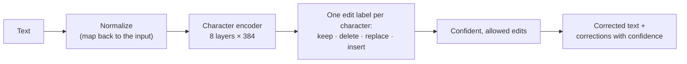

<p align="center">
  
</p>

<h1 align="center">AraSpellX</h1>

<p align="center">
  <strong>Arabic spelling and OCR error correction with a small transformer trained from scratch.</strong><br>
  It returns the corrected text and every correction, with its position and a calibrated confidence.
</p>

<p align="center">
  
  
  
  
</p>

> **Status: pre-release.** The pipeline, the model and its evaluation are complete, and the current model passes 9 of the 11 release gates measured so far. Typed spelling errors are corrected precisely; OCR correction is safe but not yet strong enough. No model is published yet: train one with this repository ([training](docs/training.md)).

## What it does

AraSpellX reads Arabic text, typed by people or produced by OCR, and fixes spelling errors such as a missing hamza, ة written as ه, ى and ي confused, keyboard typos, merged words and the wrong-dot confusions of OCR engines. It tells you exactly what it changed:

```text
ذهبت الي الجامعه صباحا لكي احضر المحاضره الاولي، ثم قابلت صديقي في المكتبه.
ذهبت إلى الجامعة صباحا لكي أحضر المحاضرة الأولى، ثم قابلت صديقي في المكتبة.

  الي -> إلى          98%  mixed         characters 5-8
  الجامعه -> الجامعة   100%  ta_marbuta    characters 9-16
  احضر -> أحضر        94%  hamza_alef    characters 27-31
  ...                                    (6 corrections)
```

On OCR text it fixes what it is sure about and leaves the rest. In this example it corrects المدينه → المدينة and حميع → جميع but leaves the garbled النجارية and المنطفة as they are.

**Where it fits:**

- **RAG and search pipelines**: clean Arabic text before indexing it, so that a misspelled word still matches its correct form.
- **OCR post-processing**: fix typical OCR confusions in scanned Arabic documents without risking the text that was read correctly.
- **Text cleaning and review**: every correction comes with its span in the original text and a confidence, so a pipeline can apply only confident edits, show suggestions or just flag words.

**What it leaves alone:** digits, Latin text, symbols and punctuation are never changed. Correct, dialect and diacritized text stays as written: in tests the model changed 0.007% to 0.058% of correct words.

## How it works


```mermaid
flowchart LR
    A["Text"] --> B["Normalize<br/>(map back to the input)"]
    B --> C["Character encoder<br/>8 layers × 384"]
    C --> D["One edit label per character:<br/>keep · delete · replace · insert"]
    D --> E["Confident, allowed edits"]
    E --> F["Corrected text +<br/>corrections with confidence"]
```


- **Characters in, edits out.** The text is read one character at a time, and for each character the model predicts an edit label: keep it, delete it, replace it, or insert something after it. Correct text stays correct by default, every change is an explicit decision with a probability, and one pass over the text is enough.
- **A BERT encoder, our own implementation.** Eight Transformer encoder layers, each a self-attention block followed by a feed-forward network (figure on the right), with relative positions. The weights are standard Hugging Face `BertForTokenClassification` weights.
- **Trained from scratch, in two stages.** The encoder first learns Arabic by restoring hidden characters in 2.09 billion characters of Wikimedia text, then learns to correct from a mix of clean text, typed-error noise, real OCR output and real spelling fixes mined from Wikipedia's edit history.
- **Honest confidence.** Confidences are calibrated on development data, separately for typed and OCR input, and an edit is applied only above a threshold chosen to keep damage on clean text below 0.05%.

<sub>Figure: "Transformer, one encoder block" by <a href="https://github.com/dvgodoy/dl-visuals">Daniel Voigt Godoy (dvgodoy)</a>, <a href="https://creativecommons.org/licenses/by/4.0/">CC BY 4.0</a>, via <a href="https://commons.wikimedia.org/wiki/File:Transformer,_one_encoder_block.png">Wikimedia Commons</a>.</sub>

Details: [architecture](docs/architecture.md) · [training](docs/training.md) · [data](docs/data.md)

## Results

Measured on frozen test sets of real text that training never saw ([full results](docs/evaluation.md)):

| | Result |
|---|---|
| Real typing errors (Wikipedia spelling fixes) | **96%** of the model's changes to those words match the editor |
| 27 hand-corrected typed sentences | precision **100%**, word errors 38.4% → 3.8% |
| Clean text: correct words changed | **0.007–0.058%** (modern, classical, diacritized and dialect text) |
| Real scanned pages made worse | **0.3%** (2 of 591) |
| Word errors removed on real scans | **13%** (17% on ABBYY output, 8% on Tesseract output); the target is 20% |
| Speed on a laptop CPU (4 threads, ONNX) | **410 words/s** (int8), 337 (fp32) |

The two gates the model does not pass yet are both on real scans: it removes too few word errors (13% against a target of 20%), and 5.1% of its edits there do not help (target 5%).

## Quick start

```bash
git clone -b v1 https://github.com/mahmoudalrefaey/AraSpellX.git && cd AraSpellX
uv sync
```

With a trained model in `artifacts/correct/best_model`:

```bash
python -m araspellx.correct.demo                              # web page at http://localhost:8000
python -m araspellx.correct.demo --text "ذهبت الي الجامعه"     # one text in the terminal
```

```python
from araspellx.correct.corrector import Corrector

result = Corrector("artifacts/correct/best_model").correct("ذهبت الي الجامعه", source="typed")
print(result.text)            # ذهبت إلى الجامعة
for c in result.corrections:  # span in the input, before, after, confidence, category
    print(c.start, c.end, c.original, c.replacement, c.confidence, c.category)
```

[Usage guide](docs/usage.md): options, outputs, what the model changes and its limitations.

## Design choices

A few decisions shaped the current model; the documents explain each in detail.

- **Relative positions.** With BERT's usual absolute positions, character-level pretraining stalled at character frequencies; relative positions fixed it ([architecture](docs/architecture.md)).
- **An attention cap during training.** One attention head's scores grew without limit and collapsed the first full pretraining run; capping them costs nothing measurable ([training](docs/training.md)).
- **Real spelling fixes, learned only where the editor changed something.** One Wikipedia edit fixes only some of a paragraph's errors; learning from whole paragraphs would teach the model to keep the others ([training](docs/training.md)).
- **Scoring that matches the use.** OCR edits often fix a word only partly, so the OCR gate limits harmful edits; real-edit references leave errors unfixed, so they are scored on the words the editors fixed ([evaluation](docs/evaluation.md)).

## Repository layout

```text
araspellx/
  text/         character set, normalization with offset mapping, tokenizer
  model/        BERT encoder (masked-LM and token-classification heads)
  data/         Wikimedia extraction, held-out split, deduplication, edit labels
  noise/        typed-error noise and rendered-OCR training pairs
  ocr/          page rendering, degradation and Tesseract (run in the OCR container)
  testsets/     builders of the test sets and the Wikipedia edit miner
  train/        pretraining, correction training, attention cap, progress display
  correct/      decoding, the Corrector and the local demo
  eval/         evaluation and release gates, metrics, error categories, CPU speed
docker/ocr/     the pinned OCR environment (Tesseract 5, Arabic fonts, 7-Zip)
benchmarks/     27 hand-corrected typed sentences
docs/           usage, architecture, training, data, evaluation
```

`data/` (downloads and generated datasets) and `artifacts/` (models and reports) are created locally and are not tracked.

## Documentation

| Document | Covers |
|---|---|
| [Usage](docs/usage.md) | installation, the demo, the command line, the Python API, limitations |
| [Architecture](docs/architecture.md) | text processing, the model, edit labels, decoding, confidence |
| [Training](docs/training.md) | the two training stages, settings, safety features, monitoring |
| [Data](docs/data.md) | sources and licenses, held-out split, building every dataset |
| [Evaluation](docs/evaluation.md) | test sets, metrics, release gates, current results |

## Roadmap

Done: data pipeline, test sets T-1, T-4, T-6 and T-7, the model trained in two stages, evaluation against the release gates with confidence calibration, the `Corrector` and a local demo.

Next:

- **Release**: a pip-installable helper package (apply, suggest and flag modes, ONNX inference on CPU), a model card with every gate result and known failure modes, the model on Hugging Face and a demo Space.
- **Protection rules**: leave Quranic text, spans marked by the caller and words with two accepted spellings (مسؤول/مسئول, مائة/مئة) untouched.
- **Remaining measurements**: degraded scans (T-5, builder ready), long documents, and an audit of 200 T-1 pairs to publish the share of true spelling fixes.
- **Better OCR correction**: drop rendered OCR pairs from unreadable pages (8.4% of them are above 50% character error rate), more real scanned text, and a larger or more modern encoder within the CPU speed target.

## Acknowledgements

- This project started from [AraSpell](https://arxiv.org/abs/2405.06981) (Salhab and Abu-Khzam), which trains Arabic spelling correction on synthetic errors. Version 0 of AraSpellX, kept on the [`v0`](../../tree/v0) branch, was based on [AraSpell's code](https://github.com/msalhab96/AraSpell) (MIT, © 2022 Mahmoud Salhab); the current implementation was written anew and contains none of it.
- Correction as edit labels follows the text-editing line of work, including [GECToR](https://aclanthology.org/2020.bea-1.16/) and [Alhafni and Habash's Arabic text editing](https://arxiv.org/abs/2503.00985).
- Data: [Wikimedia](https://dumps.wikimedia.org/) (CC BY-SA); the [Yarmouk Arabic OCR Dataset](https://www.kaggle.com/datasets/eyadwin/yarmouk-ocr-dataset) (Abu Doush, AlKhateeb and Gharibeh, CSIT 2018, [doi:10.1109/CSIT.2018.8486162](https://doi.org/10.1109/CSIT.2018.8486162)); [NOD](https://zenodo.org/records/5068735) (CC BY 4.0); the [OpenITI OCR gold standard](https://github.com/OpenITI/OCR_GS_Data) (CC BY-NC-SA 4.0, evaluation only).
- OCR: [Tesseract](https://github.com/tesseract-ocr/tesseract) and `tessdata_best` (Apache-2.0); fonts Amiri, Noto and Scheherazade (SIL Open Font License).

## License

The code is released under the [MIT License](LICENSE). Data keeps the license of its source (see [data](docs/data.md)); the license of the trained model will be set when it is released.
