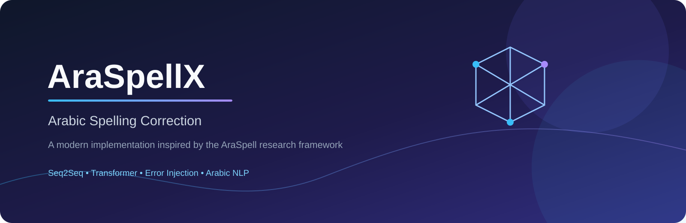

<p align="center">
  
</p>

<h1 align="center">AraSpellX</h1>

<p align="center">
  <strong>A character-level Arabic transformer, trained from scratch, that detects and corrects spelling errors and OCR corruption.</strong><br>
  Built to be a trustworthy component of Arabic NLP pipelines: RAG preprocessing, text cleaning and OCR post-processing.
</p>

<p align="center">
  
  
  
  
</p>

> **Status:** v1 is under active development. The data pipeline, test sets, model and training code are in place; models are being trained. No release or benchmark results yet.

---

## What it does

AraSpellX takes raw Arabic text, typed by people or produced by OCR, and returns the corrected text **plus every edit it made**, each with its position in the original text, a confidence and an error category. Pipelines can apply only confident edits, show suggestions, or just flag likely errors.

It corrects modern standard and classical Arabic:

| Typed errors | OCR errors |
|---|---|
| Missing or wrong hamza (اصبح → أصبح, لأرسال → لإرسال) | Wrong dots on the right letter shape (نحسين → تحسين, حميع → جميع) |
| ة/ه and ى/ي habits (الجامعه → الجامعة, الي → إلى) | Similar-shape confusions, broken ligatures |
| Hamza seats (السوال → السؤال, كفائة → كفاءة) | Merged or split words |
| Typos: missing, extra, swapped and neighbouring-key letters | Stray marks, kashida and spurious diacritics |
| Merged and split words | Garbled words recoverable from context |

It is designed to **never touch** what it should not: digits, Latin text, punctuation, Quranic quotations and dialect text pass through unchanged, and diacritics are preserved.

## How it works

- **Edit labels, not rewriting.** An encoder reads the text one character at a time and predicts, for each character, *keep*, *delete*, *replace with x* or *insert y after it*. Correct text stays correct by default, every change is an explicit decision with a probability, and one pass over the text is enough (fast on CPU).
- **Trained from scratch.** The model is our own BERT implementation, weight-compatible with Hugging Face's `BertForTokenClassification`, so released checkpoints load with plain `transformers`. It is first pretrained on raw Arabic text (masked characters), then trained to correct.
- **Real errors, not only rules.** Training mixes clean text, typed-error noise, OCR errors produced by a real OCR engine on rendered and degraded pages, real OCR output from scanned documents and real human corrections.
- **Measured on real data.** Frozen test sets of real scans, classical books and clean text (to measure damage), deduplicated against all training data.

Details: [architecture](docs/architecture.md) · [data](docs/data.md) · [evaluation](docs/evaluation.md)

## Repository layout

```text
araspellx/          the v1 package
  text/             character set, normalization (with offset mapping), tokenizer
  model/            BERT encoder (masked-LM and token-classification heads)
  data/             corpus extraction, held-out splits, deduplication, edit labels
  noise/            typed-error noise and rendered-OCR training pairs
  ocr/              rendering, page degradation, Tesseract (run in the OCR container)
  testsets/         builders of the frozen test sets
  train/            pretraining and correction training
  correct/          decoding predictions into corrected text and edits
  eval/             edit-level metrics, error categories, CPU speed benchmark
docker/ocr/         the pinned OCR environment (Tesseract 5, Arabic fonts)
tests/              unit tests
benchmarks/         small real-world benchmark (27 hand-corrected sentences)
```

`data/` holds downloaded sources and generated datasets; it is not tracked.

## Getting started

Requirements: Python 3.10, [uv](https://docs.astral.sh/uv/), an NVIDIA GPU for training, Docker for the OCR steps.

```bash
uv sync                                   # create .venv with all dependencies
uv run pytest tests -q                    # unit tests
docker build -t araspellx-ocr docker/ocr  # OCR environment (Linux container)
```

Commands that run inside the OCR container use:

```bash
docker run --rm -v "$PWD:/work" -w /work araspellx-ocr python3 -m <module> ...
```

## Building the data

```bash
# 1. Wikimedia dumps (2026-10-01) -> clean paragraphs
for w in arwiki arwikisource arzwiki arywiki; do
  curl -L -o data/raw/wikimedia/$w-20261001-pages-articles.xml.bz2 \
    https://dumps.wikimedia.org/$w/20261001/$w-20261001-pages-articles.xml.bz2
  python -m araspellx.data.wikimedia data/raw/wikimedia/$w-20261001-pages-articles.xml.bz2 data/v1/corpus/$w.jsonl
done

# 2. Test sets (see docs/evaluation.md for downloads)
python -m araspellx.testsets.clean                            # T-7 clean text
<container> python3 -m araspellx.testsets.yarmouk ocr && python -m araspellx.testsets.yarmouk build
<container> python3 -m araspellx.testsets.nod ocr     && python -m araspellx.testsets.nod build
<container> python3 -m araspellx.testsets.openiti ocr && python -m araspellx.testsets.openiti build

# 3. Training data (filtered against every test set)
python -m araspellx.data.pretrain_corpus --tests data/v1/testsets data/raw/nod/gt/ground_truth/yarmouk_gt data/raw/openiti/ara
<container> python3 -m araspellx.noise.ocr_pairs --count 100000
```

## Training

Both stages:
- save a checkpoint every 20 minutes and resume when the same command is run again
- show a live progress bar (loss, accuracy, learning rate, throughput, GPU memory)
- write timestamped messages to `train.log` and charts to TensorBoard (`logs/`) in the output folder
- choose the precision for the GPU (`--precision auto`: bf16 on RTX 30xx/A100, fp16 on T4)

Run the short check first.

```bash
# Pretraining (masked characters)
python -m araspellx.train.pretrain --out artifacts/pretrain_check --max_steps 2000 --eval_every 500
python -m araspellx.train.pretrain --out artifacts/pretrain --max_steps 80000

# Correction (edit labels), starting from the pretrained encoder
python -m araspellx.train.correct --out artifacts/correct_check --max_steps 1000 --eval_every 500
python -m araspellx.train.correct --out artifacts/correct --max_steps 30000
```

## Roadmap to v1

- [x] Character set, normalization with offset mapping, Hugging Face tokenizer
- [x] Own BERT implementation, verified identical to Hugging Face's
- [x] Model size fixed by a CPU speed benchmark (8 layers × 384, relative positions, 15.1M parameters)
- [x] Wikimedia corpus, held-out splits, test-set deduplication
- [x] Pinned OCR container; real-scan, classical and clean-text test sets
- [x] Typed-error noise and rendered-OCR training pairs
- [ ] Real typed-error test set mined from Wikipedia edit history (T-1)
- [ ] Pretraining and correction training
- [ ] Calibrated confidence, refinement passes, protection rules (Quran, accepted variants)
- [ ] Helper package (`correct()` with apply / suggest / flag modes) and ONNX CPU inference
- [ ] Evaluation against the release gates, model card, Hugging Face release

## Legacy baseline

v0, a reimplementation of the AraSpell sequence-to-sequence approach, is archived on the separate [`legacy-v0`](../../tree/legacy-v0) branch with its own README, data guide and limitations. It is the baseline v1 is compared against and is not part of this workflow.

## Acknowledgements and data

- **AraSpell** (Salhab & Abu-Khzam, [arXiv:2405.06981](https://arxiv.org/abs/2405.06981)) introduced training Arabic spelling correction on synthetic errors; it is the starting point and the baseline of this project.
- Edit-label correction follows the text-editing line of work, including [GECToR](https://aclanthology.org/2020.bea-1.16/) and [Alhafni & Habash's Arabic text editing](https://arxiv.org/abs/2503.00985).
- Training text: [Wikimedia](https://dumps.wikimedia.org/) projects (CC BY-SA).
- Test data: [Yarmouk Arabic OCR Dataset](https://www.kaggle.com/datasets/eyadwin/yarmouk-ocr-dataset), [Noisy OCR Dataset](https://zenodo.org/records/5068735) (CC BY 4.0), [OpenITI OCR gold standard](https://github.com/OpenITI/OCR_GS_Data) (CC BY-NC-SA 4.0, evaluation only).
- OCR: [Tesseract](https://github.com/tesseract-ocr/tesseract) with `tessdata_best` (Apache-2.0); fonts Amiri, Noto and Scheherazade (OFL).

## License

Code: [MIT](LICENSE). Data and models derived from Wikimedia text follow CC BY-SA attribution requirements.
