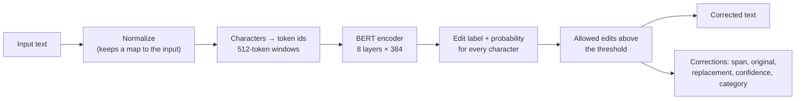

# Architecture

AraSpellX corrects a text in one pass of a small encoder over its characters. For every character the model predicts an **edit label**: keep it, delete it, replace it, or insert something after it. Applying the confident labels gives the corrected text; grouping them per word gives the list of corrections.

## Text processing

- **Character set** (`araspellx/text/charset.py`): 210 tokens. Arabic letters (including alef wasla and Persian and Urdu letters used in foreign names), diacritics, tatweel, Arabic and ASCII punctuation, three digit systems, Latin letters, symbols, whitespace and five special tokens (`[PAD] [UNK] [CLS] [SEP] [MASK]`). Anything else is `[UNK]`.
- **Normalization** (`araspellx/text/normalize.py`): folds look-alike code points (ی → ي, ک → ك, ہ/ھ/ە → ه, ۃ → ة), expands presentation-form ligatures, composes letters stored as a base letter plus a combining hamza or madda (ا + ٔ → أ), and removes tatweel and invisible characters. Diacritics are kept. Every normalized character remembers the span of the input it came from, so corrections map back to the caller's text exactly.
- **Tokenizer** (`araspellx/text/tokenizer.py`): one token per character, as a standard `PreTrainedTokenizerFast`.

## The model

AraSpellX uses its own implementation of the BERT encoder (`araspellx/model/bert.py`). Parameter names, shapes and computations follow Hugging Face's `BertForMaskedLM` and `BertForTokenClassification` (post-norm layers, GELU), so the saved weights load in plain `transformers`; outputs agree with Hugging Face's classes within 1e-5. The same encoder is trained twice: as a masked-character model (pretraining) and then with a label classifier on top (correction, see [training](training.md)).

| | |
|---|---|
| Layers × hidden size | 8 × 384, 6 attention heads, feed-forward 1536 |
| Positions | 512, **relative** (Hugging Face's `position_embedding_type="relative_key"`) |
| Parameters | 15.1M |
| Output | one of 178 edit labels per character |

**Why relative positions.** With BERT's usual absolute positions, character-level pretraining stalled: the model learned only character frequencies and never learned to look at neighbouring characters, on real text and on a toy task where every masked letter is given away by its neighbour. With relative positions (a learned score for the distance between two characters) it learns this within the first ~1,000 steps.

**Size and speed.** The size was chosen as the largest that meets the CPU speed target (`araspellx/eval/speed.py`: the model exported to ONNX, 4 threads of an Intel i5-10500H):

| Layers × hidden | Positions | Parameters | Words/s (fp32) | Words/s (int8) |
|---|---|---|---|---|
| 6 × 384 | absolute | 11.0M | 699 | 954 |
| 8 × 384 | absolute | 14.6M | 491 | 746 |
| **8 × 384** | **relative_key** | **15.1M** | **337** | **410** |
| 8 × 384 | relative_key_query | 15.1M | 245 | 268 |
| 12 × 384 | absolute | 21.7M | 360 | 492 |
| 8 × 512 | absolute | 25.7M | 331 | 499 |

Rows with absolute positions were measured when the size was chosen (exported from Hugging Face's classes), the relative rows with this implementation.

## Edit labels

Each input character gets one label (`araspellx/data/labels.py`):

| Label | Meaning | Example |
|---|---|---|
| `K` | keep | |
| `D` | delete | الججامعة → الجامعة |
| `R:x` | replace with x | الجامعه → الجامعة (`R:ة` on ه) |
| `…+s` | then insert s after it | المعلوماتالمطلوبة → المعلومات المطلوبة (`K+ ` on ت) |

The `[CLS]` token carries insertions before the first character. Labels are derived by aligning noisy and clean text character by character; the label set is the most frequent edits that cover 99.5% of the training edits (178 for the current model). Edit labels rather than generating the corrected text means one pass instead of one decoder step per character, correct text kept by default, and native positions and confidences.

**Allowed edits** (`allowed_label`, applied to training labels and predictions alike):

- Only editable characters are changed or followed by insertions: Arabic letters, diacritics, tatweel and spaces. Digits, Latin text, symbols and existing punctuation are never changed; the inserted or replacement text may restore a punctuation mark that an OCR engine read as a letter.
- Spacing next to punctuation follows Arabic typography: a mark attaches to the word before it (opening brackets and quotes to the word after), so a space on that side may be removed but never added, and the space on the other side is never removed.

## Decoding

`araspellx/correct/decode.py` runs the model once over a text and keeps, for every character, its most likely label and that label's probability. Long texts are read in 512-token windows that overlap by 64 characters on each side; each character takes the prediction of the window in which it sits furthest from the edges. An edit is applied only if it is allowed and its probability reaches the **threshold** (0.9 for the current model, chosen on development data by the evaluation). Running the model again on its own output was measured and adds almost nothing (+0.02 recall on typed text, none on OCR), so one pass is used.

## Corrections and confidence

`araspellx/correct/corrector.py` turns the applied labels into corrections, one per changed word (a merge of two words is one correction). A correction's confidence is the lowest probability among the word's edited characters, mapped through a **calibration**: an isotonic fit from confidence to observed accuracy on development data, one for OCR input and one for typed input (`calibration.json`, written by the evaluation). Calibration makes confidences track how often edits are right: measured per proposed character edit on the real OCR test sets (T-4, T-6), the expected calibration error falls from 0.085 to 0.048.
