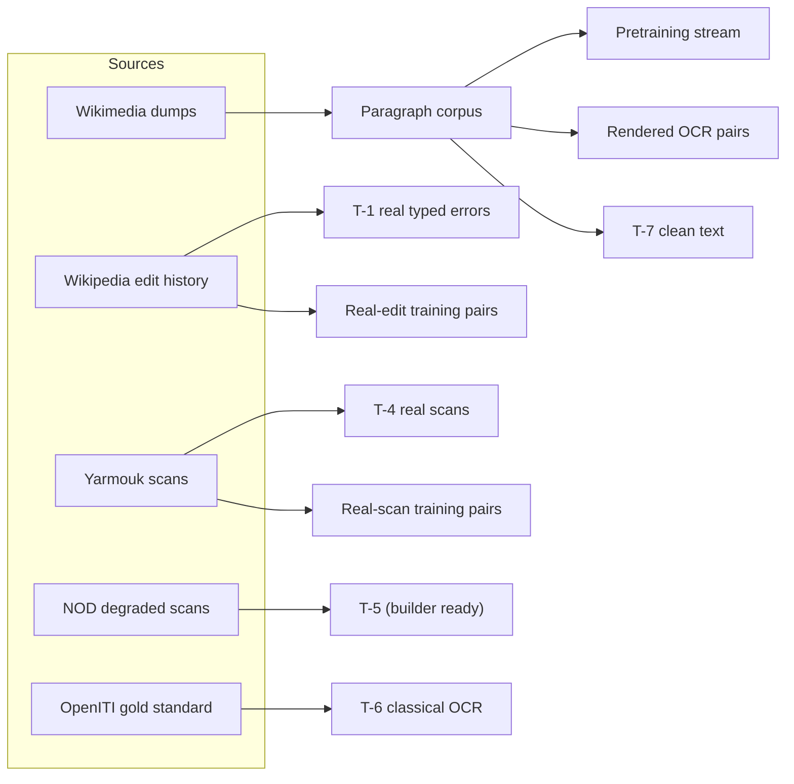

# Data

Everything AraSpellX trains and is tested on comes from public sources. This guide lists the sources and their licenses, the held-out split that keeps test text out of training, and the commands that rebuild every dataset. Downloaded and generated data live in `data/`, which is not tracked by Git.



## Sources and licenses

| Source | Used for | License |
|---|---|---|
| [Wikimedia dumps](https://dumps.wikimedia.org/) of 2026-10-01: Arabic, Egyptian Arabic and Moroccan Arabic Wikipedia, Arabic Wikisource | pretraining text, clean and noisy training text, T-7 | CC BY-SA |
| Arabic Wikipedia edit history (same dump, 54 files, 11 GB) | T-1, real-edit training pairs | CC BY-SA |
| [Yarmouk Arabic OCR Dataset](https://www.kaggle.com/datasets/eyadwin/yarmouk-ocr-dataset): 4,587 Wikipedia articles printed and scanned at 300 dpi, with ABBYY output | T-4, real-scan training pairs | listed on Kaggle as CC0; the text is Wikipedia's (CC BY-SA) |
| [NOD, Noisy OCR Dataset](https://zenodo.org/records/5068735): 100 Yarmouk pages in many noise versions | T-5 | CC BY 4.0 |
| [OpenITI OCR gold standard](https://github.com/OpenITI/OCR_GS_Data): lines of seven classical books | T-6 only | CC BY-NC-SA 4.0, evaluation only |
| [Tesseract](https://github.com/tesseract-ocr/tesseract) with [`tessdata_best`](https://github.com/tesseract-ocr/tessdata_best) 4.1.0; fonts Amiri, Noto and Scheherazade | OCR engine and page rendering | Apache-2.0; SIL Open Font License |

License statements are as published by each source; check them again before redistributing any data.

## Held-out pages

`araspellx/data/splits.py` assigns every wiki page to one of 10,000 buckets by hashing its wiki and page id, so anyone can recompute the split from a page id:

| Buckets | Use |
|---|---|
| 0–49 | clean-text test sets (T-7) |
| 50–299 | Arabic Wikipedia pages whose edits form T-1 |
| 300+ | training |

Training text is also filtered against every test set: any paragraph that shares an 8-word passage with a test text is dropped (`araspellx/data/dedup.py`). Yarmouk articles are split by article into test (300), development (300) and training (3,887), and the 100 NOD pages are kept out of training.

## Building the data

Steps that run OCR or read 7-Zip archives run in the OCR container; the others run in the project environment.

```bash
docker build -t araspellx-ocr docker/ocr
alias container='docker run --rm -v "$PWD:/work" -w /work araspellx-ocr python3 -m'
```

**1. Wikimedia text**: download the four `*-20261001-pages-articles.xml.bz2` dumps into `data/raw/wikimedia/`, then extract paragraphs:

```bash
for w in arwiki arwikisource arzwiki arywiki; do
  python -m araspellx.data.wikimedia data/raw/wikimedia/$w-20261001-pages-articles.xml.bz2 data/v1/corpus/$w.jsonl
done
```

**2. Test sets.** Place the Yarmouk archive in `data/raw/yarmouk/` (folders `Training/` and `Testing/`), the NOD files in `data/raw/nod/` and OpenITI's `ara` folder in `data/raw/openiti/ara`:

```bash
python -m araspellx.testsets.clean                                            # T-7
container araspellx.testsets.yarmouk ocr && python -m araspellx.testsets.yarmouk build    # T-4, dev, training pairs
container araspellx.testsets.openiti ocr && python -m araspellx.testsets.openiti build    # T-6
container araspellx.testsets.nod ocr     && python -m araspellx.testsets.nod build        # T-5
```

**3. Real edits** (T-1 and training pairs; downloading takes about an hour, mining several hours):

```bash
container araspellx.testsets.edits download --workers 2
container araspellx.testsets.edits mine --workers 6
python -m araspellx.testsets.edits build
```

**4. Training data**, filtered against every test set:

```bash
python -m araspellx.data.pretrain_corpus --tests data/v1/testsets data/raw/nod/gt/ground_truth/yarmouk_gt data/raw/openiti/ara
container araspellx.noise.ocr_pairs --count 100000
```

| Output | Content |
|---|---|
| `data/v1/pretrain/train.bin`, `valid.bin` | one byte per character: 2.09B training characters (Arabic Wikipedia 1.47B, Wikisource 469M, Egyptian Wikipedia capped at 150M, Moroccan Wikipedia 12M) and 16.5M validation characters; 491,359 paragraphs overlapping a test set and 1,522,190 duplicates removed |
| `data/v1/pairs/ocr_render.jsonl` | 93,499 rendered OCR pairs |
| `data/v1/pairs/yarmouk_train.jsonl` | 104,553 real-scan pairs (51,729 Tesseract, 52,824 ABBYY) |
| `data/v1/pairs/wiki_edits_train.jsonl` | 255,878 paragraphs with real spelling fixes |
| `data/v1/testsets/` | the test sets ([evaluation](evaluation.md)) and the Yarmouk development set |

## Training text in detail

- **Clean text**, unchanged: paragraphs from the pretraining stream, including dialect and diacritized text, teach the model to leave correct text alone.
- **Typed-error noise** (`araspellx/noise/typed.py`), generated on the fly: spelling habits measured in real text (dropped hamza on alef, ة/ه, ى/ي, hamza seats, ظ/ض, dropped alef after waw) and keyboard typos inside words (insert, delete, swap, neighbouring key), merged and split words. Only Arabic words are touched.
- **Rendered OCR** (`araspellx/noise/ocr_pairs.py`): paragraphs of 80–600 characters (70% Wikipedia, 30% Wikisource) rendered at 300 dpi in five open Arabic fonts at 10–16 points, given a random mix of scan defects (`araspellx/ocr/degrade.py`: thin or heavy ink, slight skew, low resolution, blur, uneven background, sensor noise, binarization, JPEG compression) and read back by Tesseract. Each pair stores its character error rate; 8.4% of the pairs come from pages the engine could hardly read (above 50%) and are currently kept.
- **Real OCR**: Yarmouk's training articles, read by Tesseract in the container and by ABBYY (the dataset's own output), aligned to the ground truth paragraph by paragraph.
- **Real edits** (`araspellx/testsets/edits.py`): consecutive revisions of every Arabic Wikipedia article are compared. A paragraph becomes a pair when the only differences are 1–5 spelling fixes of at most two characters on Arabic words (merges and splits included). Edits that only add or remove a prefix (ال, و, ف, ب, ك, ل) are grammar, not spelling, and are dropped; so are fixes a later revision undid, and one fix may repeat only a few times so that a bot's rule does not dominate. Each pair records the fixes of one edit only; the paragraph may contain other errors.

## OCR environment

`docker/ocr/Dockerfile` pins Ubuntu 24.04, Tesseract 5 with the `tessdata_best` 4.1.0 Arabic model, Pillow with libraqm for Arabic shaping, poppler, 7-Zip, and the Amiri, Noto and Scheherazade fonts. All OCR data, for training and testing, is produced in this one environment, so the OCR engine and fonts never change between datasets.

```bash
container araspellx.ocr.check    # renders a sentence, reads it back and prints the result
```
