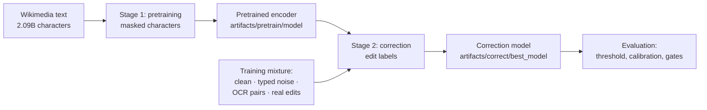

# Training

The model is trained from scratch in two stages: **pretraining** teaches a character encoder Arabic by restoring hidden characters, and **correction training** teaches it to predict an edit label for every character. Both need the datasets described in [data](data.md).



Both stages run on one GPU with bf16 (fp16 with loss scaling on GPUs without bf16, such as the T4). The current model was trained on an RTX 3060 Laptop GPU (6 GB): pretraining took about 8 hours and correction training about 4 hours.

## Stage 1: pretraining

`araspellx/train/pretrain.py` trains `BertForMaskedLM` on the character stream built by `araspellx/data/pretrain_corpus.py`. In every window 15% of the characters are hidden, half as whole words and half as random spans of 1–5 characters; of those, 80% become `[MASK]`, 10% a random letter and 10% stay unchanged. The model learns to restore them.

| Setting | Value |
|---|---|
| Steps | 80,000, each with 16,384 characters |
| Windows | 128 characters for the first 90% of the steps, then 512 (as in the original BERT) |
| Optimizer | AdamW (β 0.9/0.98, ε 1e-6, weight decay 0.01, none on LayerNorm and biases) |
| Learning rate | 5e-4 after 2,000 warm-up steps, cosine decay to 10% |
| Evaluation | every 2,000 steps on held-out text, with example fills |

```bash
python -m araspellx.train.pretrain --out artifacts/pretrain_check --max_steps 2000 --eval_every 500   # check (~15 min)
python -m araspellx.train.pretrain --out artifacts/pretrain --max_steps 80000                         # full run
```

In the check run, validation accuracy should rise clearly above 0.20 (the level of a model that only knows character frequencies) by step 1,500. The current encoder reached a validation loss of 1.633 and a masked-character accuracy of 0.549 on 512-character windows. The pretrained encoder is saved in Hugging Face format in `artifacts/pretrain/model`.

## Stage 2: correction training

`araspellx/train/correct.py` loads the pretrained encoder, adds a label classifier and trains `BertForTokenClassification` on 512-character windows drawn from a mixture ([data](data.md)):

| Source | Share | Size |
|---|---|---|
| Clean training paragraphs: teach "leave correct text alone", including dialect and diacritized text | 35% | the pretraining stream |
| The same paragraphs with typed-error noise, generated on the fly | 25% | |
| OCR pairs: rendered pages and real Yarmouk scans read by Tesseract and ABBYY | 30% | 196,086 pairs |
| Real spelling fixes mined from Wikipedia's edit history | 10% | 253,294 pairs |

A real Wikipedia edit fixes only some of a paragraph's errors and leaves the others in place, so windows from mined edits are learned from **only on the words the editor changed**; the rest of the window is ignored by the loss instead of being taught as correct.

| Setting | Value |
|---|---|
| Steps | 30,000, each with 32 windows |
| Learning rate | 2e-4 after 1,000 warm-up steps, cosine decay to 5% |
| Labels | built from 20,000 sampled windows: the most frequent edits covering 99.5% of the edits, each seen at least 20 times |
| Evaluation | every 2,000 steps: precision, recall, F0.5 and damage on development sets of typed errors, clean text, OCR pairs, real scans and real edits |

```bash
python -m araspellx.train.correct --out artifacts/correct_check --max_steps 1000 --eval_every 500   # check (~10 min)
python -m araspellx.train.correct --out artifacts/correct --max_steps 30000                       # full run
```

In the check run, the typed-error set should show recall above zero by step 1,000 while damage on clean text stays near zero. The model with the best mean F0.5 over the typed, OCR and real-scan development sets is kept in `artifacts/correct/best_model` (step 28,000 for the current model); the real-edit set is reported but not used for this choice, because its references leave some errors unfixed.

## After training

Run the evaluation ([evaluation](evaluation.md)); it chooses the confidence threshold on development data and writes the calibration. Copy the calibration into the model folder so the `Corrector` uses it:

```bash
python -m araspellx.eval.run --model artifacts/correct/best_model --out artifacts/eval/correct
cp artifacts/eval/correct/calibration.json artifacts/correct/best_model/
```

## Safety features

Both trainings:

- **save a full checkpoint every 20 minutes** (`last.pt`) and resume when the same command is run again; `--resume_from` starts a new output folder from another checkpoint;
- **keep the best model** (`best.pt`, `best_model/`) by validation loss (pretraining) or mean development F0.5 (correction), and **stop by themselves** if the score becomes clearly worse than the best (10% higher validation loss, or a mean F0.5 0.15 lower);
- **cap attention scores**: every 50 steps the largest attention score of each head is measured on fixed text, and a head above 50 has its query scaled down to exactly 50 (`araspellx/train/stability.py`). Scores are linear in the query, so what the head attends to is unchanged, and the saved model stays a standard BERT. The first full pretraining run collapsed at about 45,000 steps when one head's scores grew to 10 million; capping that head cost nothing measurable.

## Monitoring

The progress bar shows the loss, the accuracy (masked characters, or characters that need an edit), the learning rate, the gradient norm, throughput and GPU memory. Every message and a metrics line every 100 steps go to `train.log` in the output folder, each evaluation to `eval.jsonl`, and charts to TensorBoard:

```bash
tensorboard --logdir artifacts
```

Evaluation lines also report the largest attention score per layer and any head the cap had to scale.

## Options

| Option | Pretraining | Correction |
|---|---|---|
| `--max_steps`, `--batch_size`, `--lr`, `--warmup` | 80,000 · 32 (×512 characters) · 5e-4 · 2,000 | 30,000 · 32 windows · 2e-4 · 1,000 |
| `--eval_every`, `--ckpt_minutes` | 2,000 · 20 | 2,000 · 20 |
| `--precision auto\|bf16\|fp16\|fp32` | auto | auto |
| `--attention_cap`, `--cap_every` | 50 · 50 | 50 · 50 |
| other | `--short_window 128`, `--short_fraction 0.9`, `--stop_worse 0.10`, `--resume_from`, `--layers`, `--hidden` | `--pretrained`, `--ocr_pairs`, `--edits`, `--yarmouk_dev`, `--stop_drop 0.15` |
